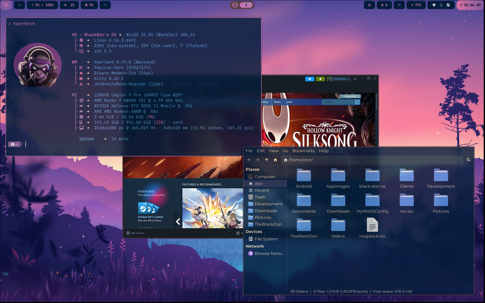

# ❄️ Pok OS — Powered by NixOS ❄️

A personal, flake-based [NixOS](https://nixos.org) configuration. It provides a
reproducible Wayland desktop with **both Hyprland and Niri** available at the
login screen, themed with Stylix, and managed entirely through Nix flakes and
Home Manager. It is built on top of [ZaneyOS](https://gitlab.com/zaney/zaneyos).



## ✨ Features

- 🪟 **Dual Window Managers** — Hyprland and Niri, both available at login (no rebuild to switch)
- 🎨 **Stylix theming** — system-wide color coordination from a single wallpaper
- 📦 **Modular** — enable only the features you need in `variables.nix`
- 🎮 **Multi-GPU** — NVIDIA (desktop + hybrid laptop), AMD, Intel, and VM profiles
- 🔁 **Reproducible** — one `flake.nix`, rebuild anytime, roll back on failure

## 🚀 Installation

Pok OS installs straight from the flake — no custom installer or ISO required.
The shipped `hosts/default/hardware.nix` is a **placeholder** (it has no real
disk UUIDs and no bootloader), so you must regenerate it for your machine in
step 4 or the installed system will not boot.

### Fresh machine

1. Boot the official [NixOS ISO](https://nixos.org/download) (Graphical or
   Minimal) and get a shell with networking.
2. Partition, format, and mount your disk at `/mnt` (ESP → `/mnt/boot`,
   root → `/mnt`).
3. Clone this repo as the target config:
   ```bash
   git clone https://github.com/Lorenzx18/pok-os /mnt/etc/nixos
   cd /mnt/etc/nixos
   ```
4. **Generate the real hardware config** (replaces the placeholder):
   ```bash
   sudo ./generate-hardware-config.sh
   ```
   This writes `hosts/default/hardware.nix` from your actual disks. For a
   different host use `--host <name>`; on an already-installed system add
   `--root /`.
5. Set your GPU PCI IDs in `hosts/default/variables.nix`:
   ```bash
   lspci | grep VGA   # note the two Bus IDs, e.g. 0000:01:00.0 and 0000:06:00.0
   # edit intelID / nvidiaID (format "PCI:1:0:0")
   ```
6. Install:
   ```bash
   sudo nixos-install --flake /mnt/etc/nixos#default
   ```
7. Reboot. At the SDDM login, pick **Hyprland** or **Niri**.

### Already have a booting NixOS

Clone to `~/pok-os`, then:

```bash
cd ~/pok-os
sudo ./generate-hardware-config.sh --root /   # regenerates hosts/default/hardware.nix
sudo nixos-rebuild switch --flake .#default
```

> To target a different host, replace `default` with that host's name (and make
> sure it exists in `flake.nix` / `hosts/`).

### Apply updates / rebuild

Once installed, you manage the system with `nixos-rebuild` (Home Manager is
invoked automatically by the flake):

```bash
cd ~/pok-os
sudo nixos-rebuild switch --flake .#default
```

Convenient shell aliases are provided:

```bash
nrs   # sudo nixos-rebuild switch --flake .#default
nfu   # nix flake update && sudo nixos-rebuild switch --flake .#default
```

## 📁 Project Structure

```
pok-os/
├── flake.nix                      # Inputs + per-host configurations (mkHost)
├── generate-hardware-config.sh    # Regenerates hosts/<host>/hardware.nix
├── hosts/
│   └── default/         # The one host (variables.nix, hardware.nix, host-packages.nix)
├── modules/
│   ├── core/            # System configuration (boot, network, drivers, features)
│   ├── drivers/         # GPU drivers (amd, intel, nvidia, nvidia-prime, vm)
│   └── home/            # User environment (Hyprland, Niri, shells, apps)
├── profiles/            # Hardware profiles (amd, intel, nvidia, nvidia-laptop, vm)
├── wallpapers/          # placeholder.png + your own wallpapers
└── img/                 # Screenshots used by this README
```

## 🎨 Customization

Almost everything is controlled from `hosts/default/variables.nix`. After
editing, rebuild with `nrs` (or `sudo nixos-rebuild switch --flake .#default`).

```nix
# hosts/default/variables.nix
timeZone          = "Asia/Manila";
keyboardLayout    = "us";
browser           = "zen";        # zen, firefox, vivaldi, brave, chromium
terminal          = "kitty";      # kitty, alacritty, ghostty
defaultShell      = "zsh";        # zsh, fish
barChoice         = "noctalia";   # noctalia (or dms)
enableHyprlock    = false;        # set false if using DMS/Noctalia lock screen

# Optional features (all default to false except where noted)
gamingSupportEnable   = true;
printEnable           = true;
syncthingEnable       = true;
enableCommunicationApps = true;
enableExtraBrowsers   = true;
enableProductivityApps = true;
aiCodeEditorsEnable   = true;
# flutterdevEnable    = false;   # intentionally off
```

### Wallpaper

The repo ships with a `wallpapers/placeholder.png` so the build works out of the
box. Drop your own image into `wallpapers/` and point Stylix at it:

```nix
stylixImage = ../../wallpapers/my-wallpaper.jpg;
```

### Adding another machine

1. Copy `hosts/default/` to `hosts/<my-host>/` and edit its `variables.nix`
   (set `timeZone`, GPU `intelID`/`nvidiaID`, monitor layout, etc.).
2. Run `sudo ./generate-hardware-config.sh --host <my-host>` (add `--root /` on an
   already-installed system) to generate `hosts/<my-host>/hardware.nix`.
3. Add the host in `flake.nix` via `mkHost { hostname = "<my-host>"; profile = "nvidia-laptop"; username = "pok"; };`.
4. Build: `sudo nixos-rebuild switch --flake .#<my-host>`.

## 🪟 Window Managers

Both are always available — choose at the SDDM login screen, no rebuild needed:

- **Hyprland** — modern tiling Wayland compositor with smooth animations.
- **Niri** — scrollable tiling compositor with a unique workflow.

## 🎮 GPU Support

Selected by the `profile` argument in `flake.nix`:

- `nvidia` — dedicated NVIDIA
- `nvidia-laptop` — hybrid Intel/NVIDIA (Prime)
- `amd` — AMDGPU
- `intel` — integrated
- `vm` — virtual machine

## 🆘 Troubleshooting

```bash
# Verbose rebuild
sudo nixos-rebuild switch --flake .#default --show-trace

# Find monitor names (after first login)
hyprctl monitors

# Hybrid laptop GPU IDs
lspci | grep VGA
# → update intelID / nvidiaID in variables.nix

# Roll back if a build breaks
sudo nixos-rebuild switch --rollback
```

## 📜 Credits

- **ZaneyOS** — original configuration by Tyler Kelley (Don Williams)
- **NixOS**, **Hyprland**, **Niri**, **Stylix**, **Home Manager**

## 📄 License

Based on ZaneyOS (MIT). See [LICENSE](LICENSE) for details.
